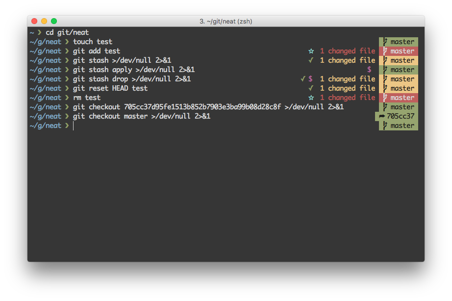

Neat
=====
###### Pretty, minimal and fast ZSH prompt with excellent Git support, based on Purity.



## Overview

Most prompts are cluttered, ugly and slow. I wanted something visually pleasing that stayed out of my way, but maintained excellent integration with Git.

### Why?

- Comes with the perfect prompt character. The original author went through the whole Unicode range to find it.
- Shows `git` state info.
- Prompt character turns red if the last command didn't exit with `0`.
- Command execution time will be displayed if it exceeds the set threshold.
- Username and host only displayed when in an SSH session.
- Shows the current path in the title and the current directory and command when a process is running.

## Install

1. Either...
  - Clone this repo
  - add it as a submodule, or
  - just download [neat.zsh](neat.zsh)

2. Symlink `neat.zsh` to somewhere in [`$fpath`](http://www.refining-linux.org/archives/46/ZSH-Gem-12-Autoloading-functions/) with the name `prompt_neat_setup`.

```sh
$ ln -s "$PWD/neat.zsh-theme" /usr/local/share/zsh/site-functions/prompt_neat_setup
```
*Run `echo $fpath` to see possible locations.*

For a user-specific installation (which would not require escalated privileges), simply add a directory to `$fpath` for that user:

```sh
# .zshenv or .zshrc
fpath=( "$HOME/.zfunctions" $fpath )
```

Then install the theme there:

```sh
$ ln -s "$PWD/neat.zsh" "$HOME/.zfunctions/prompt_neat_setup"
```

## Getting started

Initialize the prompt system (if not so already) and choose `neat`:

```sh
# .zshrc
autoload -U promptinit && promptinit
prompt neat
```


## Options

### `NEAT_CMD_MAX_EXEC_TIME`

The max execution time of a process before its run time is shown when it exits. Defaults to `5` seconds.

### `NEAT_GIT_PULL`

Set `NEAT_GIT_PULL=0` to prevent Neat from checking whether the current Git remote has been updated.

## Example

```sh
# .zshrc

autoload -U promptinit && promptinit

# optionally define some options
NEAT_CMD_MAX_EXEC_TIME=10

prompt neat
```

## Tips

The Afterglow terminal theme (shown in the screenshot above) is a great combination with this prompt. You must use a patched terminal font for the Powerline glyphs. I recommend [Monaco](https://gist.github.com/baopham/1838072).

## Integration

### [oh-my-zsh](https://github.com/robbyrussell/oh-my-zsh)

Symlink (or copy) `neat.zsh` to `~/.oh-my-zsh/custom/neat.zsh-theme` and add `ZSH_THEME="neat"` to your `.zshrc` file.

### [prezto](https://github.com/sorin-ionescu/prezto)

Symlink (or copy) `neat.zsh` to `~/.zprezto/modules/prompt/functions/prompt_neat_setup` alongside Prezto's other prompts. Then `set zstyle ':prezto:module:prompt' theme 'neat'` in `~/.zpreztorc`.

### [antigen](https://github.com/zsh-users/antigen)

Add `antigen bundle stevenmirabito/neat` to your .zshrc file (do not use the `antigen theme` function).
